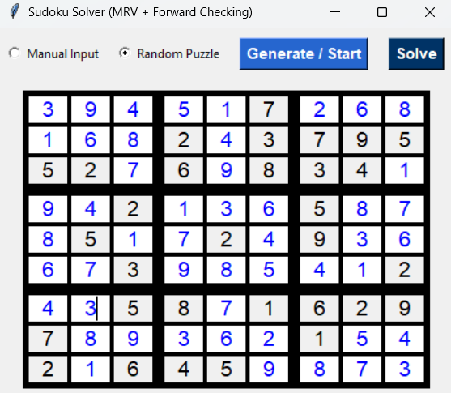

# 🧩 Optimized Sudoku Solver — MRV + Forward Checking (with GUI)

This project implements an **optimized Sudoku solving engine** based on advanced **Constraint Satisfaction Problem (CSP)** techniques. The solver follows a **recursive backtracking** framework, enhanced with heuristic variable selection and constraint propagation to achieve substantial efficiency gains.

---

## ⚙️ Algorithm Overview

At its core, the solver combines two complementary AI search methods:

**1️⃣ Minimum Remaining Values (MRV)**  
- MRV selects the unassigned cell with the fewest legal values remaining.  
- This heuristic reduces the branching factor and prioritizes the most constrained positions.  
- Essentially, it applies an information‑theoretic approach: solving the hardest decisions first, leading to faster convergence.

**2️⃣ Forward Checking (FC)**  
- After assigning a value to a cell, FC removes that value from all constraints (row, column, block) related to neighboring cells.  
- This ongoing domain filtering prevents propagation of invalid partial states.  
- As a result, the solver avoids deep recursion into inconsistent configurations.

Together, these techniques transform standard backtracking into an **intelligent search engine**, capable of solving hard Sudoku puzzles efficiently while maintaining full logical consistency.

---

## 🧠 Core Architecture

The implementation adopts a **modular OOP structure**, separating computation and visualization into distinct layers:

```
sudoku_solver/
│
├── core/
│   ├── sudoku_solver.py          → Contains SudokuSolver class (MRV + Forward Checking)
│   ├── sudoku_generator.py       → Puzzle generation
│   ├── gui.py       → GUI Interface
│
└── main.py     → Entry point to launch the graphical interface
```

---

## 🧩 Performance Characteristics

- **Baseline:** Traditional Backtracking (depth‑first exploration)
- **Heuristic Layer:** MRV reduces variable uncertainty
- **Constraint Propagation:** FC limits search depth by early pruning  
- **Temporal Dynamics:** Solving time reduction observed by several orders of magnitude on complex puzzles compared to naïve traversal


The optional **callback interface** allows live monitoring from the GUI without modifying solver internals.

---

## 🖥️ Visualization Layer

A visual interface built with **Tkinter** illustrates the solving process:

- **Manual Mode:** user inputs any Sudoku puzzle  
- **Random Mode:** automatic puzzle generation  
- **Animation:**  
  - Blue ⟶ successful placement  
  - Red ⟶ backtrack  

The GUI uses a non‑blocking update mechanism so users can observe real‑time propagation and constraint checking during the solving sequence.

---

## 🚀 Execution

Install dependencies (Tkinter included in most Python distributions):

```
python main.py
```

Expected output flow:
- The window opens with options to load or generate a puzzle.  
- Sequential solving animation begins when **Solve** is pressed.  
- The terminal prints `✅ Sudoku solved successfully!` upon completion.

---

## 🧩 Summary of Contributions

- Implementation of **MRV heuristic** and **Forward Checking propagation**  
- Integration of a **callback mechanism** for interactive visualization  
- Clear separation between computational logic and GUI layer  
- Modular, research‑grade code suitable for AI & CSP demonstrations  

---

## 🧱 Example GUI Layout




---
**Author:** Shantiya  
**License:** MIT  

**GitHub:** [github.com/ShantiyaShamushaki](https://github.com/ShantiyaShamushaki)

